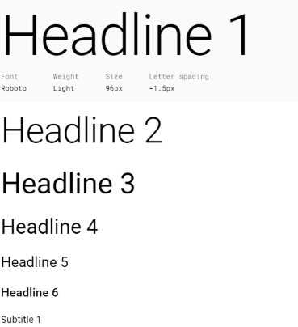
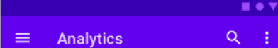
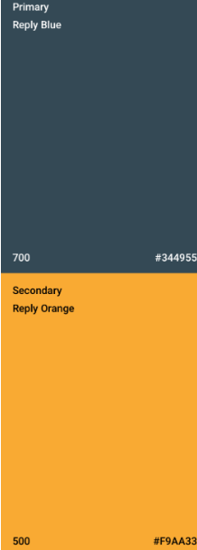

# Análisis de MuseMap   
Enlace a caso de estudio:
https://blog.prototypr.io/musemap-street-art-app-ux-case-study-9bec6a99823b

Comienzan buscando los que podrían ser sus usuarios principales. Es decir, cuál sería el **perfil de sus usuarios**. Deciden observar como actúan las personas con el arte público. Esto es una gran idea, ya que les permite detectar qué necesitan los usuarios que aún no exista, o cómo mejorar lo ya existente. Además no solo observan, también escuchan las quejas del público, esto permite de forma clara saber qué desean los usuarios potenciales.

Su siguiente paso es realizar un **análisis de competencia** para no cometer los mismos errores que las aplicaciones existentes, y usar sus fortalezas. También les permite pensar ideas que actualmente no apliquen ningún competidor del sector. Algo que considero muy eficaz durante el análisis de competencia y que no mencionan, es observar los comentarios que dejan los usuarios (p.e. en App Store). Esto permite no repetir sus fallos en todos los ámbitos, ya que no basta con ver qué ofrecen y qué no, si no en cómo lo ofrecen. Además, esto nos puede permitir ver fallos que no habíamos detectado nosotros.

Acto seguido realizan un primera **entrevista** con varias personas para saber la forma de pensar y las necesidades de los usuarios y poder tenerla en cuenta en el diseño.Esto permite saber qué espera su público potencial y ayuda a la creación de 2 “personas” que coinciden con el perfil de usuario al que va dirigida la aplicación. Con estas personas realizan un “user journey” y un “experience map”.

Con todo esto realizado, es el momento de comenzar con el diseño. Primero realizan el **flujo de usuario**. Este mapa, aunque no está mal ya que el usuario no tiene que realizar demasiadas acciones para llegar a cualquier funcionalidad, si que debería tener “atajos” ya que hay que pasar por demasiadas pantallas.

Una vez han decidido el flujo de usuario comienza el diseño de las diferentes **vistas** que tendrá la aplicación. Realizan unos primeros bocetos a papel y los someten a test mediante entrevistas. Es importante adaptarse a los diferentes estándares existentes en las diferentes plataformas. En mi opinión hacen bien en realizar entrevistas desde el principio del desarrollo enseñando los bocetos en papel, de esta forma reciben un feedback temprano, pudiendo modificar el diseño sin que suponga un gran coste de recursos. También es importante coger un grupo lo suficientemente amplio para ver coincidencias entre todas las opiniones. Si se tienen en cuenta pocas opiniones, se acabaría realizando para un usuario concreto sin llegar a la mayoría del público si éste opina diferente al entrevistado.

Tras las entrevistas, realizan una **segunda iteración** de diseño para solventar los errores detectados en las entrevistas. Una vez corregidos se vuelve a realizar otra ronda de entrevistas.

Cuando se obtiene una versión más definitiva se realiza el **sitemap**. Este paso es importante ya que permite saber toda la estructura que tendrá el proyecto y la navegación que tiene. También permite detectar si por ejemplo, para realizar una acción hay que navegar por demasiadas páginas. Es importante que las acciones más importantes y usadas estén fácilmente accesibles.

A continuación se pasa a decidir el **diseño del estilo**. Esta fase  en mi opinión es crítica, pues es lo primero que se encontrarán los usuarios. Una interfaz que guste hará que los usuarios le sigan dando una oportunidad a la aplicación. Sin embargo, si nada más abrir la aplicación por primera vez no les gusta lo que ven, es muy probable que la desinstalen y no la aconsejen a otras personas. En este paso se eligen los colores, las fuentes y los iconos a usar. Es importante que estos iconos se entiendan fácilmente para no confundir a los usuarios.

En mi opinión, los métodos más eficaces para realizar un buen diseño que guste a los usuarios son las entrevistas con ellos, pues es la forma de recibir el mejor feedback. Aunque si los entrevistados deben decir su opinión directamente delante de los desarrolladores pueden sentirse cohibidos a la hora de realizar críticas. Podría ser mejor que además de dar su opinión a los desarrolladores directamente, pudieran rellenar en un papel y de forma anónima  para que expresen todo lo que piensen.


# Propuesta de elementos de diseño o patrones a usar 

Dado que la principal plataforma para la que se desarrollará es móvil, y concretamente Android, se ha decidido emplear los estándares que la plataforma propone para el diseño.
Por lo tanto nuestro diseño estará inspirado en Material Design. (enlace patrón)
Para la fuente, se utilizará Roboto pues al ser la fuente más asociada a Material Design, los usuarios de Android estarán acostumbrados a usarla.



Para aprovechar mejor el espacio, cuando se quiera remarcar un texto como un título o una pequeña descripción, en lugar de ampliar el tamaño de letra, lo que hará será ampliar el grosor de las letras, es decir, utilizar el **negrita**. Y se restringirán los tamaños de letra a un máximo de 3, para que quede un diseño lo más sencillo y simple posible.

En cuanto al color, se utilizará una paleta de colores sencilla ya que la aplicación no requiere de muchos colores. Se elegirá un color primario y un color secundario. El color primario y secundario deberán diferenciarse de forma fácil, pues el secundario se utilizará para llamar la atención del usuario sobre ciertos botones o partes importantes de la interfaz. A su vez, cada uno de ellos tendrán un color “adicional” asignado, que será usado para dar sombras al estilo de la imagen que se muestra a continuación.



En la imagen se aprecia como ambos colores aunque parecidos se diferencian, dando la impresión de ser una sombra.
A estos colores se añadirá el blanco y el negro para fondos y colores de fuente.
Los colores principales elegidos son <#344955> y <#F9AA33>:



En cuanto a la colocación de los elementos también se seguirá el estándar. Por ejemplo para volver a la pantalla anterior, se usará un botón (con icono de flecha orientada hacia la izquierda) en la esquina superior izquierda. Habrá una barra de navegación como la que utilizan la mayoría de las aplicaciones que permitirán ir rápidamente a las pantallas más importantes y/o más usadas.

# Historia en Video del UX Case Study

 Para el video se ha utilizado el siguiente guión como esquema:
 ```
 Vimos como mucha gente debido a los altos precios de los alquileres debían compartir 
 piso con personas que no conocían. Por ello decidimos crear una aplicación para buscar
 compañeros de piso.

Al realizar un análisis de competencia se observó como una vez encontrabas piso podías 
desinstalar la aplicación ya que ya no la necesitabas más. Por ello, hemos decidido ofrecer
un valor añadido para cuando ya tienes el piso.

Bladi ha decidido añadir la funcionalidad de “Pagos”. Cada miembro del piso podrá pagar los 
gastos comunes a los demás a través de la aplicación, consiguiendo que los usuarios continúen
usando la aplicación tras haber encontrado piso. De forma similar se les podrá pagar al casero
a través de la aplicación.

Para el diseño  tras el análisis de competencia, se plantearon dos escenarios de uso en los que
se detectaron carencias de la aplicación que se consideró la mejor y se analizó la usabilidad en 
profundidad.

La segunda etapa consistió en realizar el FeedbackCaptureGrip&Task, el sitemap, el labelling y los
wireframes. Decidimos realizar en primer lugar los bocetos ya que de ellos se podía obtener de forma
implícita el sitemap y el labelling.
Los bocetos, se realizaron por el orden como la usarían los usuarios, es decir, todos los pasos para
alquilar un piso, para realizar un pago o pedir un cobro, etc.

El Feedback Capture Grip nos permitió ver qué podíamos aprovechar de Badi, que debíamos mejorar y qué
valores añadidos podíamos incluir. De los distintos valores añadidos, decidimos incorporar las 
funcionalidades de economía colaborativa. 

Posteriormente se realizaron los bocetos lo-fi. Estos no definen la apariencia final en cuanto a colores, 
fuentes, etc sino que permiten ver cómo estructurar las  interfaces. Nos habría gustado poder realizar 
varias entrevistas con usuarios para recibir un feedback temprano.

A través de estos bocetos se elaboró el sitemap, que permite ver la navegabilidad en nuestra aplicación.

Al tener lo bocetos realizados, se obtuvieron de ellos las diferentes etiquetas usadas, así como sus iconos 
en caso de tenerlos.

Con todo esto listo era el momento de comenzar a tomar decisiones acerca de qué diseño se utilizará aunque 
echamos en falta realizar entrevistas para mostrar los bocetos a los usuarios y recibir feedback temprano.

Al centrarnos en el desarrollo para Android decidimos adoptar sus estándares como usar el patrón de diseño 
Material Design por ser el más usado, de forma que a los usuarios les resulte familiar la aplicación desde 
el primer momento.

Elegimos las fuentes a utilizar, los tamaños y los colores que tendrá la aplicación. Se decidió utilizar 
la fuente Roboto por ser simple, muy fácil de leer y estar asociada a Android. Y como colores se  eligieron
dos que contrastan bastante entre ellos de forma se pueden remarcar elementos mediante el uso del color.
```

PD: el guión ha sido solo una ayuda, y no siempre corresponde 100% con el contenido del video.

# Documentación. Valoración del equipo sobre la realización de esta práctica o los problemas surgidos
 
